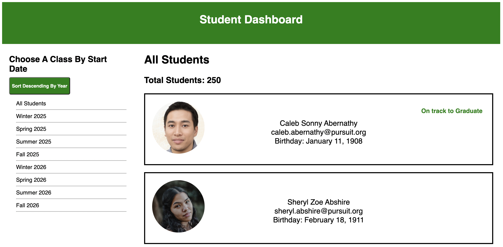
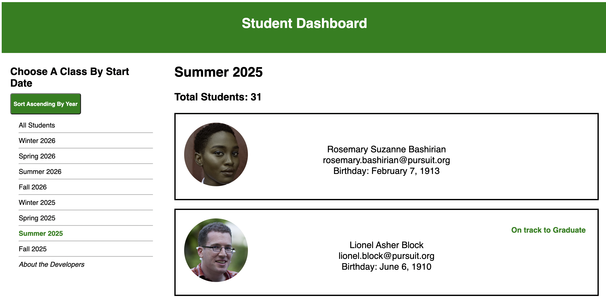
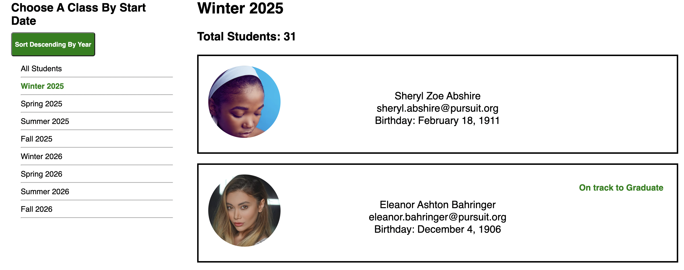
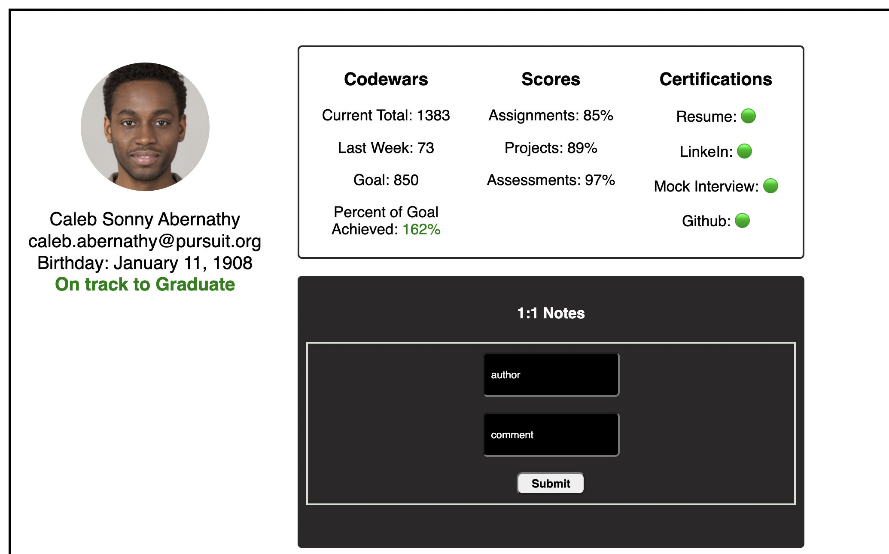
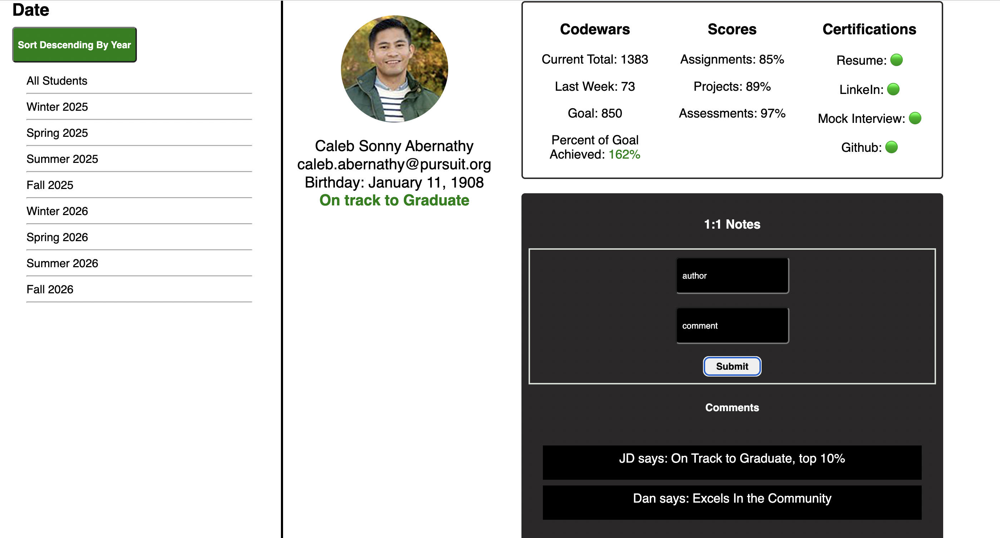
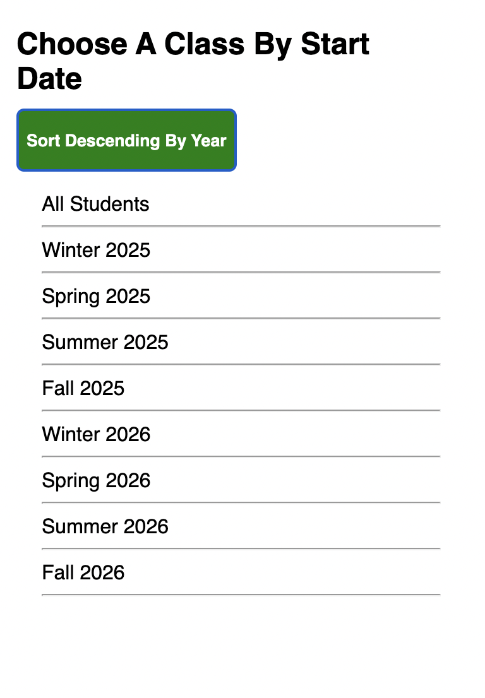
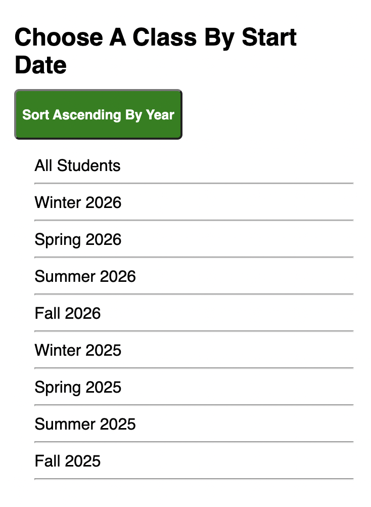

# Student Dashboard Project

The instructors in your school need a dashboard in order to track the data of each student. Many cohorts of students are represented in the data so you will have your work cut out for you displaying each cohort by Season and Year. You will work with one or more colleagues to complete this task.  

## Project Setup

- **Backend API**: Use [react-student-dashboard-reboot-server](https://github.com/10-3-pursuit/project-student-dashboard-reboot-server).
- **Frontend Repository**: Your team lead or someone on your team should`Fork` and `clone` this repo. 

## Completion Requirements

There are 6 parts to this project. Complete as many parts as you can in the given order. Points will be based on completion, code quality, appearance and team work dynamic. Each person must contribute to the planning and codebase for the app.

Responsive CSS is expected. You may use Bootstrap, Grid, and/or Flex to create your layout and design.

### Documentation

Include `readme.md` with setup instructions for front and back ends of your application. In order to create your readme...
   - create a file called `instructions.md`
   - copy and paste these project instructions into that file
   - create your instructions in the actual `readme.md` file

### Front-end Feature Specifications

#### Part 1: Static

1. A Header should show the title of Student Dashboard in an `h1` tag.

1. An `About` link should be on the application. This link will lead the user to a view that displays, at minumum, each team member's name, Github, and a fun fact

#### Part 2: Index

1. A **Student list count** should be included either in the `Aside` or the `Main` portion of the application. It displays the number of students in the displayed cohort

1. Your SPA should always show a `Header` with title, an `Aside` that will display a list of seasonal cohorts, and a `Main` section where student data is displayed.

1. **Student list.** The `Home` page should show a list of all students. Each student should be shown with the following details listed:
   - Full Name:
      - Each first letter of the student's name should be uppercase.
      - All of the following letters in the name should be lowercase.
   - Username
   - Email address, 
   user readable birthday, showing month name, day, year, (e.g. November 7, 2022), and profile photo.
   - **On-track status.** Each student should also be marked as either "On Track" or "Off Track." A student is "On Track" if **ALL** of the following is true about them:
      1.  The student has a resume certification (e.g. `certifications.resume` is `true`).
      1.  The student has a LinkedIn certification (e.g. `certifications.linkedin` is `true`).
      1.  The student has a GitHub certification (e.g. `certifications.github` is `true`).
      1.  The student has a mock interview certification (e.g. `certifications.mockInterview` is `true`).
      1.  The student has a current CodeWars score that is over 600.

#### Part 3: Show

**Additional Student Details Section** 

A User can click on a student card and they will be routed to a detailed view of the single student. This feature should include the following detailed information which you will pull and manipulate from the data:

   1. A user still sees all of the original information that was displayed in the Index Card for the student. Details listed above.
   
   1. **Codewars Stats Heading**
      - A user can see the current total
      - A user can see last week's total
      - A user can see the goal total
      - A user can see the `Percent of Goal Achieved` using properly formatted percentages

   1. **Scores Heading** 
      - A user can see properly formatted percentages for assignments
      - A user can see properly formatted percentages for projects
      - A user can see properly formatted percentages for assignments

   1. **Certifications Heading**
   - Includes whether or not the student has received certain certifications. 
   - Instead of showing "true" or "false" for certifications, show an emoji or icon depending on the certification status.

#### PART 4: 1-on-1 Notes Section 
   Create a section on the single student details view that contains information about a student's 1-on-1 with an instructor. To complete this feature, the following should be true:
   - The section should include a title. (e.g. "1-on-1 Notes".)
   - The section should include a form which includes:
      - input for instructor's name
      - input for instructor's note
      - a label for each input for accessibility
      - a submit button
   -  The form can be filled out and submitted. 
   - On submit, the inputs are cleared.
   - The section should show a list of all notes that have been added.
   - The notes can be saved locally in the component as opposed to the backend.

#### PART 5: Aside List of Cohorts
1. The **Aside List** should continuously be shown in the page view
1. **Unique list of cohorts.** The Aside should include a unique list of cohorts on the page. This list of cohorts should be human-readable (e.g. "Winter 2026" instead of "Winter2026") and ordered by both year and season combined.
1. **Clickable cohorts.** When one of the cohorts is clicked from the cohort list, the students shown on the page should change so that only those students in the cohort are displayed.
1. **Cohort title change.** When one of the cohorts is clicked from the cohort list, a heading on the page should change to display what cohort is being shown. (i.e. 'All Students' title should change to 'Winter 2025' title when that title is clicked)
1. The **Student list count** should also update to reflect the number of students in the chosen cohort.

#### PART 6: Stretch Goals

This section of the project measures your group's ability to go above and beyond in creating your project. To score points in this section, you should incorporate a feature, technology, or skill not explicitly required by the project instructions.

When you submit your pull request, _make sure to include a description of any stretch goals you implemented._ You may choose from the list below or come up with features or tasks that are more relevant to your specific implementation of the project.

- Create a button in the single student details view where you can `Unenroll` a student ('Delete'). Add functionality to delete that student from your backend server.
- Create a form that allows you to update a student's details. Make sure all of your calculations coordinate with that update.
- Use `PUT` to update the notes key in the data when adding a note for the student. In the server data, each note has a `comment` key and a  `commenter` key.
- Create a search bar to search for students based on your chosen criteria.
- Include a count for the number of notes added to each student, which is updated when a new note is added.
- Allow for the user to click a button and the view of students changes to be just a list of names, or just a grid of profile images.
- Implement a "dark mode" version of the website, which changes the CSS on click.
- Add color-coding or segmentation to the cohort list, so that each year is visually distinct from one another.

Points will be allocated in this section at the discretion of the instructor.

## Existing code

This project includes some existing code that will help you complete the features below.

- [`Data Shape`](./dataView.md): This file contains the shape of each object. The data you will be working with is an array of objects. Your data will consist of as many as 90 students. Some important key's include:
  - `id`: A unique ID associated with each student.
  - `profilePhoto`: A randomly generated photo from [Random users](https://xsgames.co/randomusers/).
  - `cohort`: An object represents which "cohort" the student is in. It includes the `cohortCode`, `cohortStartDates` and `cohortScores` which you will need to work with.
  - `notes`: This is an array of note objects holding a commenter's name and their comment. Keys are `comment` and `commenter`
## Advice

When building a project, there are additional skills to be gained alongside the tech you are learning. In this project, your ability to do the following will be observed:
How you:

- plan out your approach with your team before coding
- break large features into small, testable tasks that you can build
- synthesize multiple skills you've learned at once
- learn new skills and syntax on your own
- manage your time and stay focused on the important tasks
- check in consistantly with your time to make sure you are building the same application together
- To ask for help

**Without a good strategy, programming can be very difficult**

### Suggested process

## PROCESS

**STUDY THE DATA CAREFULLY!!!**

You will have to maneuver and massage this data. You cannot simply just render the valuse 'as-is'

Use all of the tools you have been given to create a plan of action for your team. Trello, Github, Ideation Board, etc.

Continue to slowly iterate, making small changes to complete each feature. Commit often, so that you can always undo your changes if you break something big.

## Visual Examples

The following is an example of the application. These images show the application completed at different stages of the project and highlights different parts of the project to make it clear what is being discussed. While proper CSS is expected, you are not required to replicate this layout and look. 

### Landing page

### Cohort list by Season and Year

#### Summer 2025 Index

#### Winter 2025 Index

### Student Details Show Section

#### Student Details

#### Student Details with Notes

### Cohort Lists

#### Sorted Ascending

#### Sorted Descending

