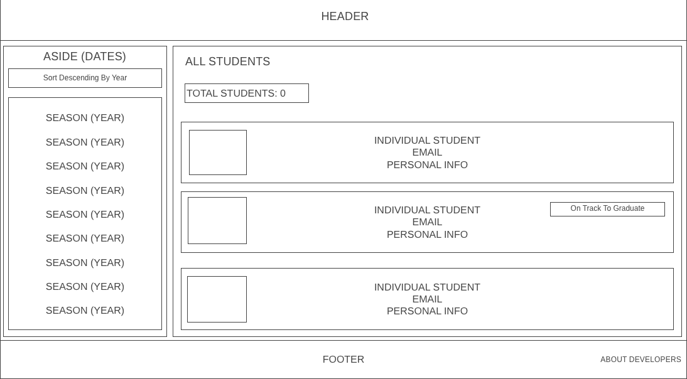
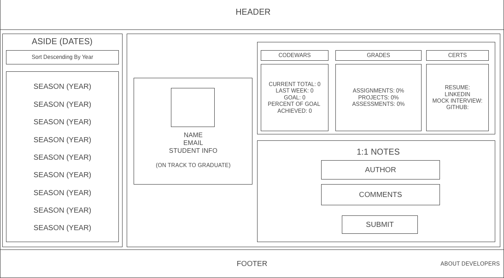
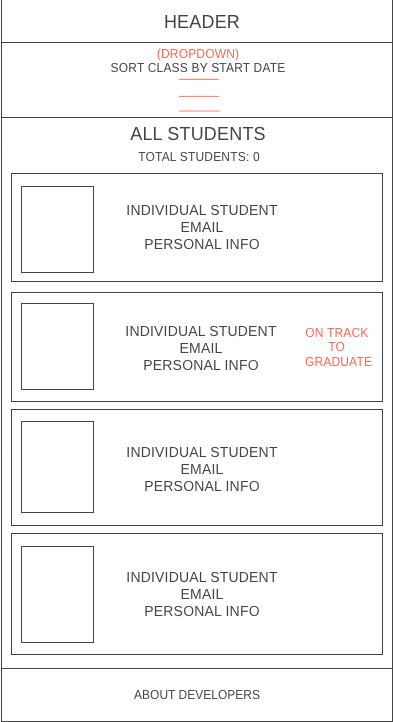
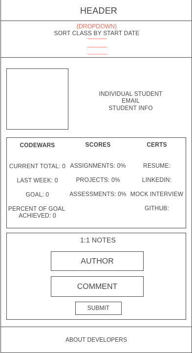
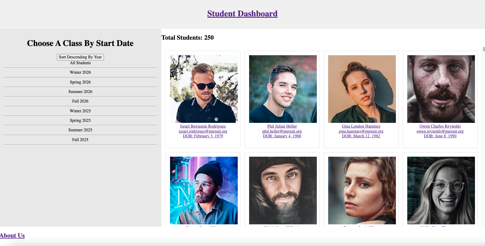
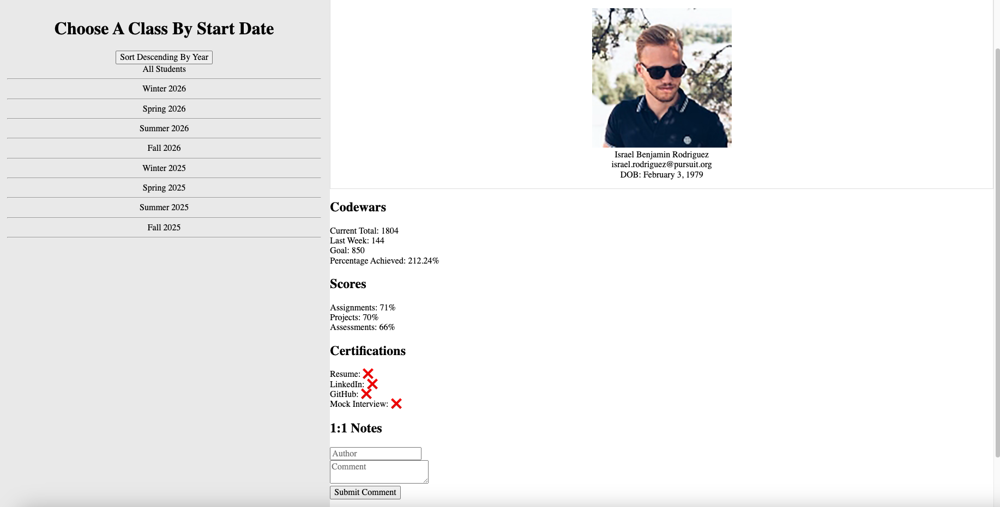

*React Student Dashboard Reboot Project (RBM)*

Welcome. Our "RBM" team -- Regis, Barrios, McLellan -- have created a Single Page Application using ReactJS to help (the needy!) instructors in our school gain access to this 'React Student Dashboard Reboot Project'. This Dashboard tracks the data associated with each student, displayed by Season and Year, either in ascending or descending order. In our implementation of this Dashboard, we teamed-up and learned to use the following **Project Tools & Skills** below:
- React Hooks
- React Router 6.2.1
- Forms
- Controlled Inputs
- Event Handlers
- Fetch API
- Promises
- Data Manipulation & Parsing
- Helper Functions
- HTML, CSS, JS
- CSS Grid (optional)
- Flexbox (optional)
- Render.com backend deployment
- Netlify.com frontend deployment
- Self learning

# ~TABLE OF CONTENTS~  
- Features
- Installation
- Components
- Bonus Items
- Contributing

# Features
-Landing page displays brief prelims on students with their name, image, email address/username, and date of birth.
-Functionality by clicking each student, expanding to their full details.
-A chronological class table of different start dates by season and year.
-Form, we used for the notes section in `Student.jsx`. It has two boxes that have to be filled out, with a `submit` button underneath.

## Installation
To run the app locally, follow these steps:
1st..
Clone the repository: git clone https://github.com/josebarrios23/project-student-dashboard-reboot

2nd...
Navigate to the project directory:
cd project-student-dashboard-reboot

3rd...
Install dependencies: npm install
Start the development server: npm start

### Components
Cohort Component
The `Cohort component` is the aside, displaying a table-like breakdown of categories according to the class start date by the season, year and including ALL students. It also has the flexibility of being in ascending or descending order:
All Students | All Students
Winter 2025  | Fall 2026
Spring 2025  | Summer 2026
Summer 2025  | Spring 2026
Fall 2025    | Winter 2026
Winter 2026  | Fall 2025
Spring 2026  | Summer 2025
Summer 2026  | Spring 2025
Fall 2026    | Winter 2025

StudentCard Component
The `StudentCard component` is the card component, displaying each of all the student's profile for their: name, user name (email address) and date of birth.

Student Component
The `Student component` -- not to mixed up with the above 'StudentCard' component, displays every single detail available per student and is a breakdown of these details once the user clicks on each student profile. It includes all the info from the 'StudentCard' in addition to Codewars totals, Score percentages and certification links for each student's Resume, LinkedIn and Github profiles.

Header Component
The `Header component` is the first interaction one should come across in the landing page, it's the simplest component, and will simply be our header display title.

Fetch API
The `Fetch API` holds a separate file for each fetch. For the two functions, a fetch grabs all the student data (think: `Student component` file), and another fetch grabs one student based on the ID (think: `StudentCard component` file).

#### Bonus Items
-Count for Comments: using the `.length` method, we've added this as our stretch goal.

##### Contributing
Contributions are welcome! To contribute to our 'Student Dashboard Reboot Project', follow these simple steps below:

**Fork the repository**
Create a new branch: git checkout -b 'feature/new-feature'
Commit your changes: git commit -am "I added new to your project..."
Push to the branch: git push origin 'feature/new-feature'
Submit a pull request.

## RBM Group Dynamic
Marlon *Regis* - marlon.regis@pursuit.org
As a coordinator and communications liason used efficiently for building out this project in the 3-person group, he ensured daily that steps and stages of some of the coding process moved along in chronological order; provided third-party tools and libraries that facilitated easy workflow via `wireframe.cc`, provided daily organizational updates in `Trello Board`; and added code to keep building the on this Student Dashboard project in the `App.jsx` file and `Footer.jsx` component file.

Jose *Barrios* - josebarrios@pursuit.org
A role of wearing many hats, Jose's handling of tasks ranged from being the main navigator behind designing our four `wireframes` -- 2 for the web and another 2 for mobile, and as the navigator with Harleigh and Marlon's 'live' input along the design, we finished that task on day one; to tackling the initial CSS to see what we're working with so that we also had a visual in the beginning, and continued to work on the `index.css` file throughout until the end; building the Aside (`Cohort`), `Header`, `Student` and Card (`StudentCard`) components, as well as the `fetch.js` API link; and the majority of the functionality and coding, including the `index.jsx` file, fell in Jose's hands (who also came up with the concept for naming our group, *RBM*).

Harleigh *McLellan* - harleighmclellan@pursuit.org
Held down the repo as the chief navigator and lead, while Jose and Marlon worked through other various branches. Unfortunately, Harleigh fell very ill soon after the beginning of working on the `Router` options during our project, so her overall contribution has been understandably minimal to this point, but we wish her a healthy recovery.

As a group, overall we got along from Day One in tackling this project. There was an automatic feeling of empathy for life being in the way. With full transparency from each of us, if life is lifing, we had an understanding that the next person would fill in, or pick up the slack if necessary, without any complaints. This `Team Norm` link was also helpful: https://docs.google.com/document/d/1bAEjA11b15igvR-FzrSh02REJOCFj03g0Z3INmgU_6Y/edit

**Set Up Instructions**

## Deploying Frontend on Netlify

### Step 1: Set Up Netlify
- Go to [Netlify](https://www.netlify.com/) and sign in or sign up.
- Click on “New site from Git”.

### Step 2: Connect to Git Repository
- Choose your Git provider (GitHub, GitLab, Bitbucket) and select your repository.
- Allow Netlify to access your repo.

### Step 3: Configure Your Site
- Set the build command as `npm run build`.
- Set the publish directory to `build/`.
- Click on “Deploy site”.

### Step 4: Domain and Launch
- Netlify provides a generated URL post-deployment.
- Optionally, set up a custom domain.

## Deploying Backend on Render

Render is useful for backend deployments. Here's how to deploy your backend on Render.

### Step 1: Prepare Your Backend Code
- Ensure your backend code is in a Git repository.
- Include a `package.json` file with the correct start script.

### Step 2: Set Up Render
- Visit [Render](https://render.com/) and log in or register.
- Select “New Service”.

### Step 3: Connect to Your Repository
- Pick the repository with your backend code.
- Check if Render auto-detects the settings correctly.

### Step 4: Configure Service
- Choose the appropriate environment (Node, Python, etc.).
- Set any required environment variables under “Environment”.

### Step 5: Deploy Your Backend
- Click “Create Service”.
- Render will deploy your backend and provide a URL.

## Post-Deployment

After deploying both frontend and backend, ensure to test your application thoroughly. Update your frontend’s API endpoints to point to the new backend service URL from Render if necessary.

## Visual Examples
The following is an example of our application during the process w/these images showing the application completed at different stages of the project. Images highlight different parts of the project to make it a bit visually clearer on what we're tackling.
WIREFRAMES (DESKTOP)👇🏾

WIreframes (mobile)👇🏾

STUDENTS by class year/season + profile detail (screenshot snippets)👇🏾

## ABOUT
Marlon Regis: "Been to all continents of the world, except 2!"
(https://github.com/MarlonPelau)
Jose Barrios: "I've been studying astronomy since I was 7!"
(https://github.com/josebarrios23)
Harleigh McLellan: "I really wanna start making video games.."
(https://github.com/hjmclellan)

**Frontend deployment - our netlify.com link**:
**Backend deployment - our render.com link**: